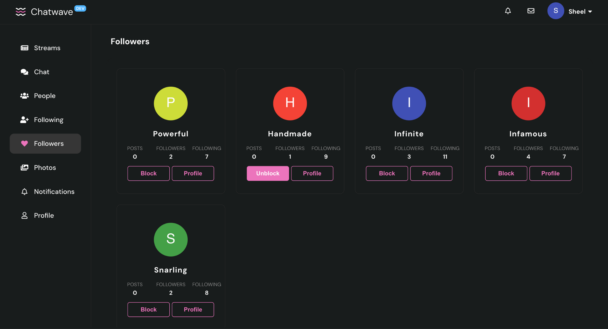
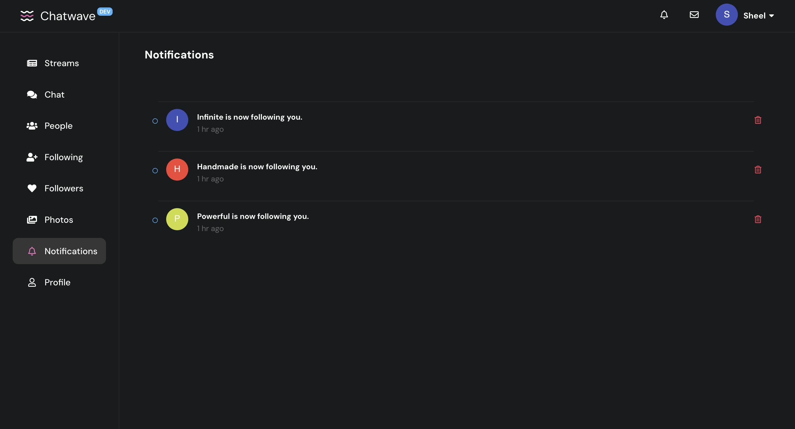
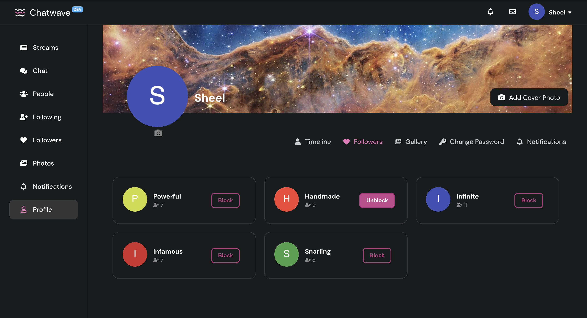

# Chatwave

Chatwave is a full stack social media application built using Node.js and React. This repository contains the backend code for the project.The code for backend can be found [here](https://github.com/sheel-ui/chatwave-backend). The demo of project can be found [here](https://www.youtube.com/watch?v=_O_kE_ll5aQ).

## Table of Contents
- [Features](#features)
- [Progress](#progress)
- [Screenshots](#screenshots)
- [References](#references)
- [Chatwave Project Setup](#chatwave-project-setup)
  - [Backend Setup](#backend-setup)
  - [Frontend Setup](#frontend-setup)
- [Note](#note)

## Features

### Application Features

# Project Features

### User Authentication & Authorization
- **Secure Sign-up/Login**: Implement JWT (JSON Web Tokens) for authentication. Use bcrypt to hash passwords.
- **Profile Management**: Allow users to update their profile information (username, bio, profile picture, etc.).

### Real-time Communication
- **Socket.IO**: Set up a Socket.IO server to handle real-time messaging and notifications.

### Chat Feature
- **Messages, Emojis, GIFs, Images**: Implement chat functionality using Socket.IO where users can send messages, emojis, GIFs, and images.
- **Message Reactions**: Allow users to react to messages with emojis.

### Post Creation
- **Text Posts and Custom Backgrounds**: Allow users to create text posts with optional custom backgrounds.
- **Image and GIF Posts**: Enable users to post images and GIFs.
- **React and Comment on Posts**: Implement functionality to react to and comment on posts.

### Social Interactions
- **Follow/Unfollow/Block Users**: Implement follow, unfollow, and block functionalities using a user relationship table in your database.
- **Create, Edit, Delete Posts**: Allow users to create new posts, edit their existing posts, and delete them.
- **Like, Comment, Share Posts**: Enable liking, commenting, and sharing of posts. Use a relational database to manage post interactions.

### News Feed
- **Display Posts**: Show posts from users that the logged-in user follows. Implement algorithms to sort posts by recency or relevance.

### Infinite Scroll and Pagination
- **Efficient Content Browsing**: Implement infinite scrolling for feeds using libraries like `react-infinite-scroll-component`.

### Search
- **Find Users and Posts**: Implement a search functionality that allows users to search for other users and posts. Use a search index like Elasticsearch for optimized searching.

### Real-time Notifications
- **Instant Notifications**: Use Socket.IO to send real-time notifications for activities like likes, comments, and follows.

### Email Notifications
- **Stay Updated**: Set up an email service (like SendGrid) to send email alerts for significant activities.

### Caching
- **Redis**: Use Redis to cache frequently accessed data, like user sessions or popular posts, to improve performance.

### Background Tasks
- **Asynchronous Tasks**: Use message queue to handle background tasks like sending emails or processing images.

### State Management
- **Redux Toolkit**: Utilize Redux Toolkit to manage the global state of your application efficiently.


## Progress

- **Backend**: Finished 🟢
- **Frontend**: Finished 🟢
- **Deployment**: In Progress 🟡

## Screenshots

### Home Page


### Chats Page


### People Page


### Photos Page


### Follower Page



### Following Page


### Notifications Page



### Profile Page


### Profile Settings Page


### Profile Followers Page



### Profile Images Page


### Sign In Page


### Sign Up Page


## References

- Figma design: Lucas Marques
- UI Inspiration: Instagram
- Webdev: Colt Steele
- Node with React: Uzochukwu Eddie Odozi
- Redux toolkil: Dickson Boateng
- Socket IO: Danny Adams

## Chatwave Project Setup

This guide provides step-by-step instructions for setting up both the backend and frontend of the Chatwave project.

### Backend Setup

#### Prerequisites

- Homebrew installed on your machine

#### Steps

1. **Install MongoDB and Redis and start the services:**
    ```sh
    brew services start mongodb-community@7.0
    brew services start redis
    ```

2. **Clone the backend repository:**
    ```sh
    git clone https://github.com/sheel-ui/chatwave-backend
    ```

3. **Navigate to the backend directory:**
    ```sh
    cd chatwave-backend
    ```

4. **Install dependencies:**
    ```sh
    npm install
    ```

5. **Setup environment variables:**
    - Create a `.env` file in the root of the `chatwave-backend` directory.
    - Add the following keys:
        ```env
        SENDGRID_API_KEY=your_sendgrid_api_key
        SENDGRID_MAIL_ID=your_sendgrid_mail_id
        CLOUDINARY_API_KEY=your_cloudinary_api_key
        CLOUDINARY_API_SECRET=your_cloudinary_api_secret
        CLOUDINARY_CLOUD_NAME=your_cloudinary_cloud_name
        ```

6. **Start the backend server:**
    ```sh
    npm run start
    ```

### Frontend Setup

#### Steps

1. **Clone the frontend repository:**
    ```sh
    git clone https://github.com/sheel-ui/chatwave-frontend
    ```

2. **Navigate to the frontend directory:**
    ```sh
    cd chatwave-frontend
    ```

3. **Install dependencies:**
    ```sh
    npm install
    ```

4. **Setup environment variables:**
    - Create a `.env` file in the root of the `chatwave-frontend` directory.
    - Add the following key:
        ```env
        GIPHY_API_KEY=your_giphy_api_key
        ```

5. **Start the frontend server:**
    ```sh
    npm run start
    ```

---

Ensure you have the required API keys and secrets set up correctly in the respective `.env` files for both backend and frontend to enable all features of the Chatwave project.


## Note

Complete documentation will be added after testing the deployment on AWS.
