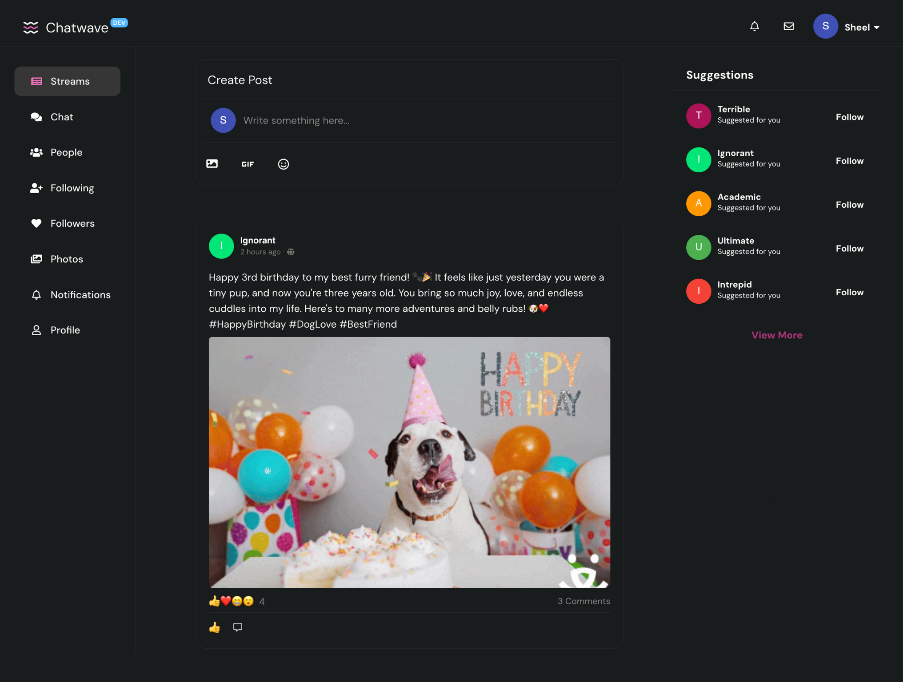

# Chatwave

Chatwave is a full stack social media application built using Node.js and React. This repository contains the backend code for the project.The code for frontend can be found [here](https://github.com/sheel-ui/chatwave-frontend).

## Features

### Application Features

- **User Authentication & Authorization**: Secure user sign-up, login, and profile management.
- **Real-time Communication**: Utilize Socket.IO for instant messaging and notifications.
- **Social Interactions**:
  - Follow/unfollow other users.
  - Create, edit, and delete posts.
  - Like, comment, and share posts.
- **News Feed**: Display posts from followed users.
- **Infinite Scroll and Pagination**: Efficiently browse content.
- **Search**: Find users and posts easily.
- **Real-time Notifications**: Get notified instantly for likes, comments, and follows.
- **Email Notifications**: Stay updated with email alerts.
- **Caching**: Use Redis for caching frequently accessed data.
- **Background Tasks**: Handle tasks asynchronously with message queues.
- **State Management**: Use Redux Toolkit for managing application state.

## Progress

- **Backend**: Finished 🟢
- **Frontend**: In Progress 🟡
- **Deployment**: Pending 🔴

## Screenshots

### Home Page

### Sign In Page

### Sign Up Page

## References

- Figma design: Lucas Marques
- UI Inspiration: Instagram
- Webdev: Colt Steele
- Node with React: Uzochukwu Eddie Odozi
- Redux toolkil: Dickson Boateng
- Socket IO: Danny Adams

## Note

Complete documentation will be added after testing the deployment on AWS.
